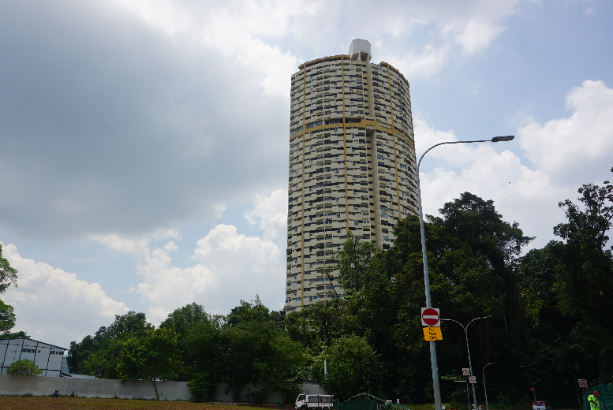
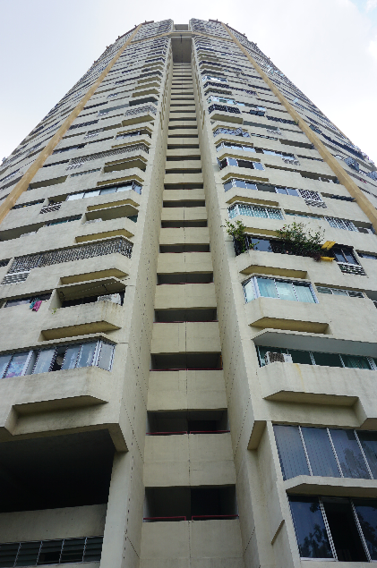
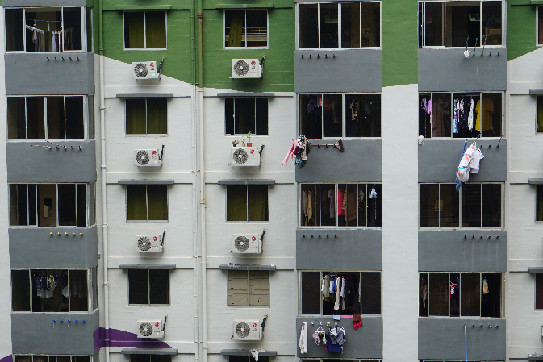

# 芳华不再——新加坡珍珠苑

在新加坡待久了的人对这栋建筑应该不陌生，远看像个圆筒，更准确地说是C形或者马蹄铁。看起来像是拉长的客家土楼。  

“这个独特的组屋一定要去参观一下”，路过几次后7我告诉自己。新加坡的高楼主要有政府组屋和私人公寓两种，“政府组屋”即是新加坡的公共住房，以优惠价格出售给人民。为什么我判断这个房子是组屋呢，因为它看起来很像组屋——颜色单调，住户密集，容积率高达7.2。实在是太内卷了！  
不过我错了，查了一番资料，我才知道这居然是私人公寓！这个公寓1976年竣工，是当时新加坡最高的住宅大楼。这么高的公寓，只有有钱人才住得起，是不折不扣的豪宅。下图是它当年的风采。  

其实走近之后才会看到，虽然这栋楼容积率很高，但它不具备组屋的另一个典型特征：衣服晒在外面。这是公寓和组屋的一个重要区别。这是珍珠苑的外侧：

这是典型组屋的外侧：

