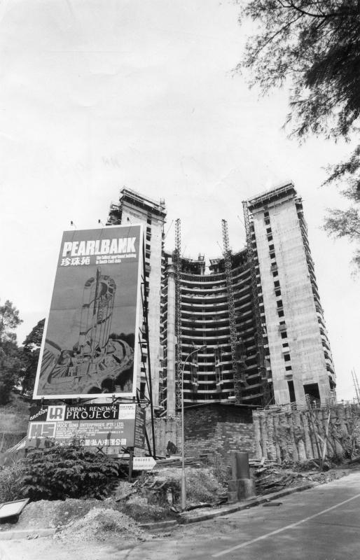

# 芳华不再——新加坡珍珠苑

在新加坡待久了的人对这栋建筑应该不陌生，远看像个圆筒，更准确地说是C形或者马蹄铁。看起来像是拉长的客家土楼。  

“这个独特的组屋一定要去参观一下”，路过几次后我告诉自己。新加坡的高楼主要有政府组屋和私人公寓两种，“政府组屋”即是新加坡的公共住房，以优惠价格出售给人民。为什么我判断这个房子是组屋呢，因为它看起来很像组屋——颜色单调，住户密集，容积率高达7.2。实在是太内卷了！(容积率是指一个小区的地上总建筑面积与用地面积的比率，越大越拥挤。高层住宅容一般不超过5，多层住宅一般不超过3。)  

不过我错了，查了一番资料，我才知道这居然是私人公寓，而不是“土土的”组屋！这个公寓叫“珍珠苑”，1976年竣工，是当时新加坡最高的住宅大楼。这么高的公寓，只有有钱人才住得起，是不折不扣的豪宅。下图是它当年的风采。  

其实走近之后才会看到，虽然这栋楼容积率很高，但它不具备组屋的另一个典型特征：衣服晒在外面。这是公寓和组屋的一个重要区别。这是珍珠苑的外侧：

这是典型组屋的外侧：

在新加坡，较新的公寓都配套有游泳池，健身房以及其他运动场地（如网球场，壁球，高尔夫，乒乓等）。但这个公寓毕竟年代久远，当年没有这些标准，因此配套设施略少。  

公寓的入口，悬挑大屋檐，在组屋你是很少能看到这样大的入口的。

移步到C形的中间，立刻别有洞天了有木有：

整齐划一：

直插云霄：

内部的花园虽然不大，却很茂盛：

朝外看，随便一个窗口便是整个CBD，不知道高层的360度全景是什么样的？

细心的读者或许会发现，内部有很多楼梯连接相邻的两层。同一个楼梯所连接的两层，一层有走廊， 另一层没有。猜猜这是为什么呢？

楼里我是不敢进去的，那是擅闯私宅。不难想象容积率这么高的地方住着总会有点压抑，就像清华的博士生宿舍（W楼）。

看一看周边吧。这是停车场楼梯间的墙，墙做成这样可以自然通风，有可以防止雨水进入：

放大看一下，小广告哪儿都有哇。

这种洞从外侧看是这样的，在新加坡的低矮老建筑中很常见：

咦，这里还有裸露的桩：

参观的时候，我们得知这个小区下个月（2019年4月）就要拆了。这次参观也算是卡着点儿了。

去年年初，这个将近40岁的老建筑被“集体出售”——也就是80%的业主同意出售的情况下，其他开发商可以买下整个区域，重新规划。很多业主觉得，“珍珠苑已老化，许多设施要经常维修，因此出售对大家都好。”

我国的房屋产权一般为70年，而新加坡有99年，999年，以及永久地契等几种。珍珠苑是99年的地契，虽然时间还不到一半，但这栋建筑实在是太老旧了。对居民而言，设施的维护成本较高，那还不如卖掉。住新楼肯定比这老楼舒服很多。

当然我并没有能仔细参观内部设施，只能看个大概。

在国内我们时常有这样的讨论：我们的房子能站立70年吗？参观完珍珠苑我知道了，建筑不怕坏，但怕老。经年日久，结构仍然很安全，但它的容颜已经衰老了，它的设计理念已经不符合现代的需求了，它的骨架限制了它无法随着人们生活方式的改变而与时俱进。

一个房产的寿命可以很长，但生命力却只有二三十年。